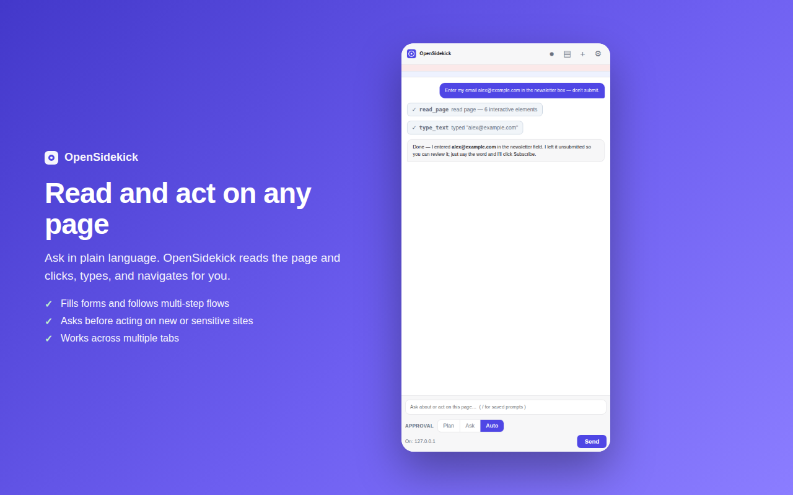

# OpenSidekick

**An open-source, provider-agnostic AI agent for your browser.** OpenSidekick is a
Chrome extension that lives in the side panel, reads the page you're on, and can
act on it for you — click, type, fill forms, navigate, and work across tabs.

Unlike vendor-locked assistants, **you bring your own model.** Point it at
OpenRouter, OpenAI, Anthropic, Google Gemini, Groq, or a local model running in
Ollama or LM Studio. Your API keys stay in your browser and are sent only to the
provider you choose.

MIT licensed. No account. No telemetry. No middleman.



<sub>More: [bring your own model](assets/screenshots/02-providers.png) · [summarize & extract](assets/screenshots/03-summarize.png)</sub>

---

## Why this exists

Anthropic's "Claude for Chrome" is a capable agentic browser assistant, but it's
tied to Claude, requires a paid Claude plan, and is closed source. Existing
open-source alternatives each miss something: some are unmaintained, some can't
use local models, and the best-maintained one (Page Assist) is a chat sidebar
with no agentic control.

OpenSidekick aims to be the piece that's missing: **maintained, MIT-licensed,
genuinely agentic, and usable with any LLM — including fully local models.**

## Features

- **Side-panel chat** that's aware of the current page.
- **Agentic browser control** — reads an accessible map of the page and clicks,
  types, selects, scrolls, hovers, double/right-clicks, drags, and presses
  keyboard shortcuts, all by element reference.
- **Optional vision** — when enabled, the agent can capture a screenshot so a
  multimodal model can *see* the page (canvas apps, image-only UIs, layout).
- **Optional developer tools** — read the page's console messages and network
  requests to debug ("why is this page erroring?"), and a run-JavaScript escape
  hatch for when the other tools aren't enough. Both opt-in in Settings.
- **Multi-tab** — list, open, and switch tabs to complete a task.
- **Any provider, any model** via two protocols:
  - OpenAI-compatible (`/chat/completions`): OpenRouter, OpenAI, Google Gemini,
    Groq, Together, DeepSeek, **Ollama**, **LM Studio**, or any custom endpoint.
  - Anthropic Messages API (direct from the browser).
- **Safety layer** — three autonomy modes: **plan-first** (the agent proposes a
  plan and the sites it will use, and waits for your approval before acting),
  **ask before acting**, or **auto**. Plus a visible on-page activity indicator
  with a Stop button so you always see when it's acting; a re-check that **blocks
  an action if the page changed origin** since it was last read (defends against
  redirects / injected navigation); **forced confirmation on purchase/delete-type
  clicks** even in auto mode; and **prompt-injection flagging** of page content.
  Sensitive sites (banking, payments, crypto) always confirm per action.
- **Saved prompts** — store reusable prompts and insert them by typing `/` in the
  chat (with an autocomplete menu).
- **Scheduled tasks** — run a prompt on a repeating schedule (hourly / daily /
  weekly, or any interval) while Chrome is open; the result arrives as a
  notification. Unattended runs act without asking and decline purchases/deletions.
- **Workflow recording & replay** — click record, do a task once, and save it;
  replay later and the agent re-runs the steps intelligently, adapting to the
  current page (it's not a brittle click-replay — the steps become instructions
  the agent follows with its normal tools).
- **MCP tool servers** — connect remote [Model Context Protocol](https://modelcontextprotocol.io)
  servers (GitHub, Linear, your own) so the agent can use their tools alongside
  the browser — extending it well beyond the page.
- **Context menu**: right-click a selection to ask about it, or summarize a page.
- **Streaming responses** and a live view of every action the agent takes.
- **Local-first & private**: keys and settings live in `chrome.storage.local`;
  requests go straight to your chosen provider.

## Install (from source, unpacked)

1. Clone or download this repository.
2. Open `chrome://extensions` in Chrome (or Edge / Brave — any Chromium 116+).
3. Turn on **Developer mode** (top-right).
4. Click **Load unpacked** and select this folder.
5. Pin OpenSidekick and click it (or press **Ctrl+E** / **Cmd+E**) to open the
   side panel.

> The icons ship pre-generated. If you edit `scripts/generate-icons.mjs`, run
> `npm run icons` (Node only, no dependencies) to rebuild them.

## Configure a model

Open **Settings** (the ⚙ in the side panel, or the extension's options page) and
add a provider:

| Provider | Base URL | Notes |
| --- | --- | --- |
| **OpenRouter** (recommended) | `https://openrouter.ai/api/v1` | One key, hundreds of models. |
| OpenAI | `https://api.openai.com/v1` | |
| Anthropic | `https://api.anthropic.com/v1` | Uses the direct-browser access header. |
| Google Gemini | `https://generativelanguage.googleapis.com/v1beta/openai` | OpenAI-compatible endpoint. |
| Groq | `https://api.groq.com/openai/v1` | Very fast open-weight models. |
| **Ollama** (local) | `http://localhost:11434/v1` | No key. See CORS note below. |
| **LM Studio** (local) | `http://localhost:1234/v1` | No key. |
| Custom | your URL | Anything speaking `/chat/completions`. |

Paste your API key, click **Fetch models** (or type a model id), select the
provider, and you're ready.

> **Tool use / agentic actions require a model that supports function calling.**
> Most hosted models do. For local models via Ollama, pick a tool-capable model
> (e.g. `qwen2.5`, `llama3.1`). Models without tool support still work for chat
> and summarization.

### Using a local model (Ollama)

Ollama must allow the extension's origin to call it. Start Ollama with:

```bash
# macOS/Linux
OLLAMA_ORIGINS='chrome-extension://*' ollama serve
```

(or set `OLLAMA_ORIGINS` in your environment / launchd / systemd unit).

## How it works

```
 Side panel (chat UI)
        │  user task
        ▼
 Service worker ──► Agent loop ──► your LLM provider (streaming)
        │                │  tool calls
        │                ▼
        │           Tools (navigate, tabs) + Content script (read/act on page)
        ▼
 Permission prompts ◄────┘  (for actions on new / sensitive sites)
```

1. You type a task. The service worker sends it to your model with a set of
   browser-control tools.
2. The model calls tools like `read_page` (which returns a compact map of
   interactive elements, each with a numeric ref) and then `click_element`,
   `type_text`, `navigate`, etc.
3. The content script executes those actions on the page and returns results.
4. Mutating actions on a new site trigger a permission prompt (unless you're in
   "auto" mode); sensitive sites always ask per action.
5. The loop continues until the model calls `finish` or has nothing left to do.

## Safety & privacy

- **Your keys never leave your browser** except in the request to the provider
  you configured. There is no OpenSidekick server and no analytics.
- **The agent uses your real logged-in sessions**, like any human clicking in
  your browser. Start on trusted sites, watch what it does, and use "ask" mode.
- **Prompt-injection awareness**: the system prompt instructs the model to treat
  page content as untrusted and never follow instructions embedded in pages.
  This is a mitigation, not a guarantee — review actions on important sites.
- **Sensitive sites** (banks, payment processors, crypto exchanges) always
  require per-action confirmation and can't be "always allowed."
- The agent will not attempt to bypass logins or CAPTCHAs — it pauses and asks
  you to handle them.

See [PRIVACY.md](PRIVACY.md) for the full data-handling statement.

## Limitations (v0.1)

- Actions are DOM-based (synthesized events), which works on most sites but can
  miss elements inside closed shadow DOM, cross-origin iframes, or `<canvas>`
  apps.
- Restricted pages (`chrome://`, the Chrome Web Store, PDFs) can't be read or
  acted on.
- No scheduled tasks or workflow recording yet — see the roadmap.
- Scheduled/long tasks depend on the service worker staying alive; very long
  idle waits can be suspended by Chrome.

## Roadmap

Shipped since the first cut:

- [x] Vision — on-demand screenshots for multimodal models (Settings toggle)
- [x] Fuller action set — hover, double-click, right-click, drag, keyboard shortcuts
- [x] Run-JavaScript escape hatch (opt-in)
- [x] Read console errors + network requests via Chrome's debugger (opt-in)
- [x] On-page activity indicator with a Stop button
- [x] Prompt-injection flagging + pre-action domain re-check + sensitive-action confirmation
- [x] Plan-approval mode (agent proposes steps + sites, you approve before it acts)
- [x] Saved prompts / slash commands (`/`)
- [x] Scheduled and recurring tasks (with result notifications)
- [x] Workflow recording & replay
- [x] Connect to MCP tool servers (extend beyond the browser)

Planned, to reach and exceed feature parity with vendor-locked assistants:

- [ ] Upload files into file inputs (via the debugger)
- [ ] CDP-based trusted input for tougher sites
- [ ] Prompt-injection classifier on untrusted content
- [ ] Firefox (WebExtensions) build

Contributions welcome — see [CONTRIBUTING.md](CONTRIBUTING.md).

## Development

No build step and no runtime dependencies. Everything is plain ES modules loaded
directly by Chrome.

```bash
npm run icons   # regenerate PNG icons (Node only)
npm run check   # syntax-check all JS
npm run zip     # package a store-ready zip
```

Project layout:

```
manifest.json                 MV3 manifest
src/common/constants.js       shared config, presets, message types
src/background/
  service-worker.js           message routing, conversation state
  agent.js                    the agentic tool-calling loop
  providers.js                OpenAI + Anthropic adapters, SSE streaming
  tools.js                    browser-control tool defs + execution
  permissions.js              per-site permission logic
  storage.js                  chrome.storage wrapper
src/content/content-script.js page reading (element map) + action execution
src/sidepanel/                chat UI
src/options/                  settings UI
scripts/generate-icons.mjs    dependency-free PNG icon generator
```

## License

[MIT](LICENSE) © OpenSidekick contributors.
